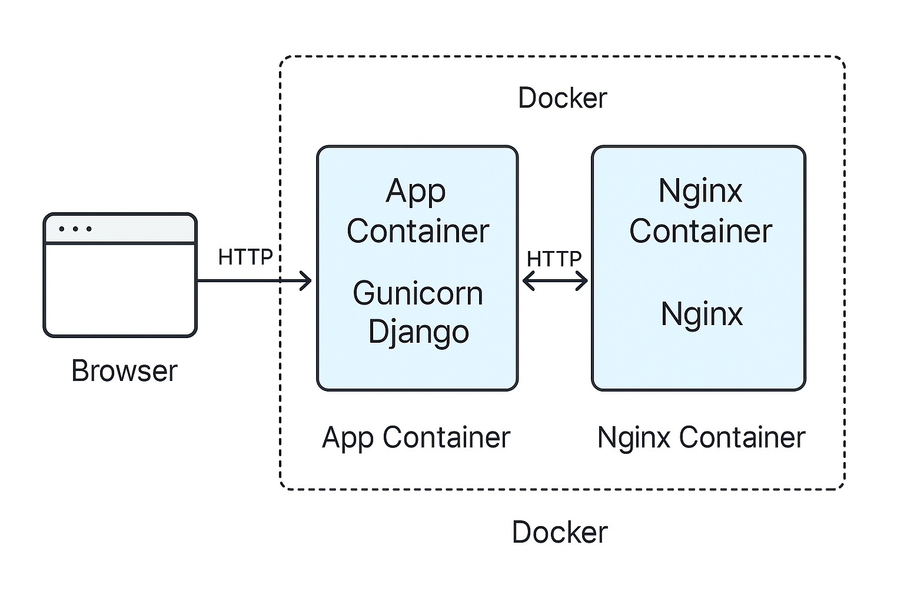
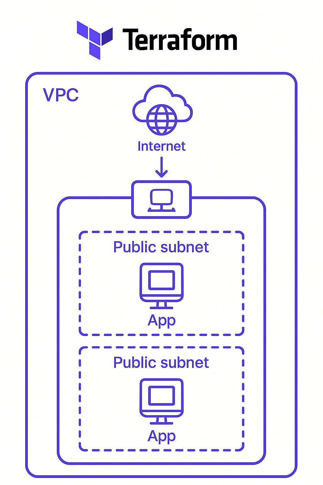
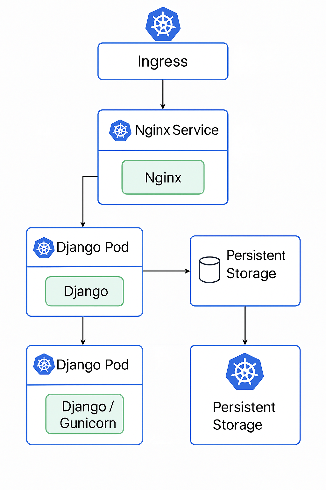

# CI/CD Management Server Overview

This project automates the CI/CD pipeline using a Jenkins container as the management server. It listens to repository changes, processes pipeline logic defined in a Groovy script, and performs conditional build and deployment actions across multiple environments.


---

## 📌 Architecture Overview

- **Trigger**: Push to remote Git repository
- **CI/CD Tool**: Jenkins (running in Docker)
- **Pipeline Definition**: `pipeline-config.groovy`
- **Artifact Registry**: Docker Registry
- **Infrastructure Provisioning**: Terraform
- **Configuration Management & Deployment**: Ansible
- **Orchestration**: Kubeadm
- **Notification**: Slack

---

## 🔁 Pipeline Flow


````

````
---

## 📄 `pipeline-config.groovy`

This Groovy file acts as the controller for the Jenkins pipeline. It:

* Reads input parameters (e.g., `ACTION=build`, `TARGET=aws`)
* Determines if the job should build, deploy, or both
* Dynamically chooses the target environment
* Calls the appropriate Ansible/Terraform commands

> ✅ Located in the root directory of the repository or `jenkins/` subdirectory.

---

## 🧱 Build Stage

* Builds Docker image for application
* Tags image with commit SHA or custom tag
* Pushes to Docker Registry (private or Docker Hub)

---


## 🚀 Deploy Stage

Deployment target is selected through Jenkins parameters or Git branch strategy.

### Options:

1. **AWS EC2**
   * Terraform used to provision infrastructure if it doesn't exist

   

   * Ansible used to configure EC2 instances and deploy the application

2. **Remote VM**

   * SSH-based deployment using Ansible playbooks

3. **Kubernetes Cluster**

   * Uses `kubeadm` if the cluster is not already initialized
   
   * Helm deploys the app as a deployment or via script bash

---

## 🔔 Notifications

After successful deployment, the pipeline sends a status notification to a Slack channel using pre-configured Webhooks.

---

## 📂 Related Docs

* [`docs/terraform/`](docs/terraform.md) – AWS provisioning
* [`docs/ansible/`](docs/ansible.md) – Playbooks and inventories
* [`docs/kubernetes/`](docs/kubernetes.md) – Cluster setup and manifests
* [`docs/jenkins/`](docs/jenkins.md) – Jenkinsfile, shared libraries, and setup

---

## 🧰 Tech Stack

| Component        | Tool/Tech        |
| ---------------- | ---------------- |
| CI/CD Engine     | Jenkins (Docker) |
| Scripting        | Groovy, Bash     |
| Infrastructure   | Terraform        |
| Configuration    | Ansible          |
| Containerization | Docker           |
| Orchestration    | Kubeadm          |
| Notification     | Slack            |

---

## 🛠️ Usage

1. Clone the repository.
2. Setup Jenkins and required plugins.
3. Configure `pipeline-config.groovy`.
4. Connect Jenkins with your Git repo.
5. Trigger builds manually or via webhooks.

---

## 🧪 Example Jenkins Parameters

```bash
PIPELINE_ACTION: 'build & deploy', // Empty to fall back to params or default  ['build & deploy', 'build only', 'deploy only']
IMAGE_TAG: '0',    // Use custom build number
SKIP_TESTS: true, // Skip tests if true
DEPLOY_K8S: false, // Deploy to Kubernetes if true
DEPLOY_AWS: false, // Deploy to AWS if true
DEPLOY_ONPREM: false, // Deploy to on-premises if true
```

---


## 📬 Contact

For issues or support, please open an issue or reach out via the internal Slack channel.


